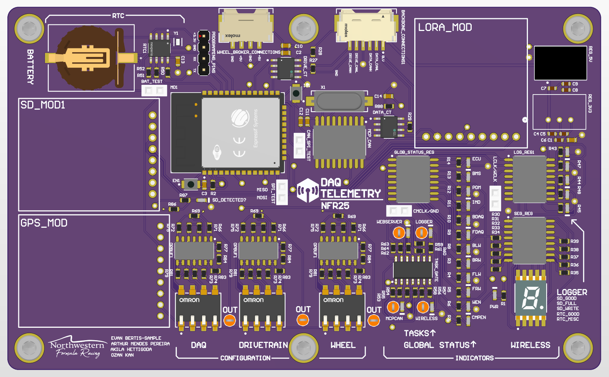

# daq-telemetry-25

<div align="center">
    
</div>

## Contents

This repository contains the firmware and tests for the `DAQ Telemetry` board for `NFR25`. This board is responsible for:
* Wirelessly transmitting data collected by the car in real time from the car to a basestation
* Logging data collected by the car to an SD card
* Ensuring that all CAN nodes are properly communicating, and if not, reporting these errors
* Tracking the location of th ecar
* Tracking the time via an RTC

## Contributing

### General Development

When developing a feature, please make a branch, and write tests where applicable. It only really makes sense to write unit tests for non-hardware features, like important data structures.

We should aim for the largest "surface area" of your code to be testable natively (on a computer, and not the actual board), thus you should architect code that you can test most of the logic without hardware.

Branches should be *short lived*, meaning that a feature to implement should be easily created and tested within a couple of days. Prefer many pull requests over a one large pull request.

Not all features can be implemented in a short time. If you run into the case where you cannot develop a feature in a few days, then make sure your branch is continuously pulled up to date with main.

### Code Quality Expectations

All code in the code base should be formatted using the standard C/C++ formatter, which comes as a part of the C/C++ extension in VSCode. This is done to keep the codebase fairly professional.

For all systems, we should strive to use `Doxygen` comments.

For example, a comment on a method should look like:

```cpp
/// @brief Adds a message to the CAN bus using the provided description.
/// Registers the onReceive callback (if provided) internally.
/// @param description The description of the message.
/// @return A reference to the newly added CANMessage.
CANMessage &addMessage(const CANMessageDescription &description);
```

You can use the `Better Comments` extension on VSCode to help with that.

All headers should use the `.hpp` suffix, to show that the header is in `C++`.

Please abide by the following naming conventions:
```
Class Names: ClassName
Public Class Members : variableName (or) functionName
Private Class Members : _variableName (or) _functionName
Local Variables: variableName
Macros : THIS_IS_A_MACRO
Constants : THIS_IS_A_CONSTANT
```


## General Resources
* [Arduino Framework Documentation](https://www.arduino.cc/reference/en/)
* [How to use Git and Github](https://product.hubspot.com/blog/git-and-github-tutorial-for-beginners)
* [How to write Good Pull Requests](https://developers.google.com/blockly/guides/contribute/get-started/write_a_good_pr)
* [Google C++ Style Guide](https://google.github.io/styleguide/cppguide.html)

## Formula Specific
* [How to Write a Driver! Example](https://github.com/NU-Formula-Racing/daq-driver-example-25): Please look through this one! We need you to write a driver for your project, as your firmware will ultimately be used as a library.
* [Non-Trivial Driver/Library Example (daqser)](https://github.com/NU-Formula-Racing/daq-serializer-24): This is a more complex example of a driver. It is a library that we used in NFR24 to serialize data for telemetry.
* [CAN Example](https://github.com/NU-Formula-Racing/CAN_Interface_Demo/blob/main/src/main.cpp): This is an example, written by the creator of our CAN Library detailing all the common use cases for the library.
* [Project Example (temp-board-23)](https://github.com/NU-Formula-Racing/daq-firmware-23/blob/jm/daqTemp/src/main.cpp): This is an example of an older project, and it might be helpful to see how we structured our code in the past.
